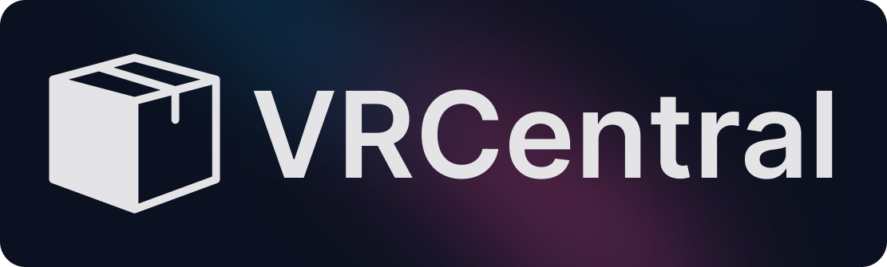

> **Note**: This project is currently under development and may not be fully functional. If you encounter any issues or have any suggestions, please feel free to open an issue or submit a pull request on the GitHub repository.

  

<h1 align="center">
  Open Source VRChat Package Registry
</h1>

## Introdcution
The VRCentral is a community-driven platform for hosting and distributing open-source packages for use in the VRChat Creator Companion. Our goal is to create a centralized hub where developers and creators can share their content, including worlds, avatars, and other assets, with the community.

## Contributing
Contributions to `vrcentral` are welcome! Please open an issue or submit a pull request on the GitHub repository.

## License
`vrcentral` is released under the [Unlicense](LICENSE.md). This means the code is in the public domain, and you can use, modify, and distribute it without any restrictions. For more information, please see the [Unlicense website](https://unlicense.org/).